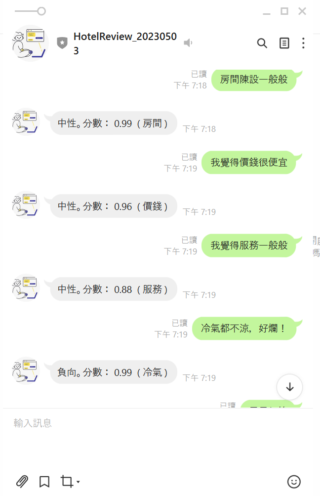

將回覆的語言改成中文:

    按照老師的簡報，加入"zh-hant"

    觀察DEBUG CONSOLE顯示的result會發現，決定評價的是results裡面的sentiment

    新增新變數sentimentText為評價

判斷分數:

    觀察DEBUG CONSOLE顯示的result會發現，決定分數的是results裡面的confidenceScores

    新增新變數sentimentScore為分數

判斷重要的主詞:

    觀察DEBUG CONSOLE顯示的result會發現，決定重要主詞的是results裡面的opinions的target.

    新增新變數mainOpinions為重要主詞

輸出評價、分數、主詞:

    改變原本的輸出為`${sentimentText}。分數： ${sentimentScore.toFixed(2)}  ( ${mainOpinions} )`

Chatbot 互動截圖:
    
